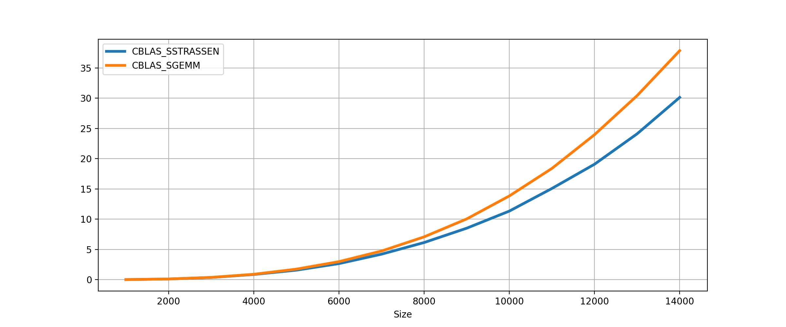

# CBLAS_STRASSEN
This repository contains an efficient implementation of the Strassen's algorithm.  
The algorithm exposes a CBLAS compatible interface and supports all the four standard datatypes: single and double floating point precision real and complex numbers.  

The algorithm improves the execution time for matrix multiplication at the cost of `3/2 N^2` additional memory.

## Installation
**TODO:** At this moment the CMake installation support only a test build with Intel MKL.  
I will provide soon a `CMakeLists.txt` for a complete installation and a complete support to any BLAS implementation.

## Usage
**TODO:** I will add a complete description of the test executables and the functions signatures.